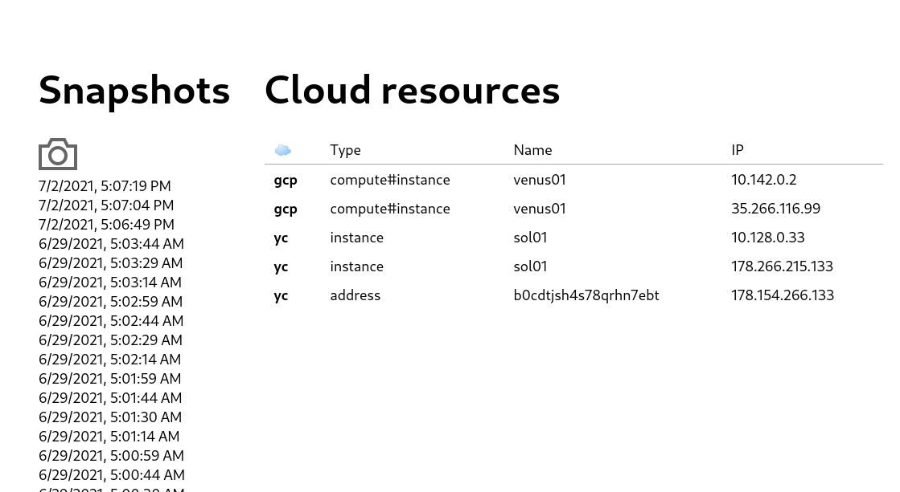

# cirrus

Get IPs of all your cloud resources

## Quick start

```shell
go get github.com/kabachook/cirrus/...
cirrus -h
```

```
Cloud Inventory made easy

Usage:
  cirrus [command]

Available Commands:
  completion  generate the autocompletion script for the specified shell
  gcp         Google Cloud Platform
  help        Help about any command
  server      Run as server
  yc          Yandex Cloud

Flags:
      --config string   config file (default is $HOME/.cirrus.yaml)
  -h, --help            help for cirrus

Use "cirrus [command] --help" for more information about a command.
```

## Example

```shell
$ cirrus gcp all --project my-project --key key.json
{"level":"info","ts":1625912546.2882447,"caller":"cmd/gcp_all.go:72","msg":"Got endpoints"}
{"level":"info","ts":1625912546.2884,"caller":"cmd/gcp_all.go:79","msg":"","endpoints":[{"cloud":"gcp","ip":"10.142.0.2","type":"compute#instance","name":"venus01"},{"cloud":"gcp","ip":"35.185.126.199","type":"compute#instance","name":"venus01"}]}
```

## Config

Defalt config path is `$HOME/.cirrus.yaml`. It can be overriden with `-c` flag/

[Example config](./cirrus.example.yaml):

```yaml
gcp:
  key: key.json # Path to key file
  project: my-project
  zones:
    - europe-north1-a
    - europe-north1-b
    - europe-north1-c
    - us-east1-d
  aggregated: true # use aggregated queries if possible

yc:
  token: AQAA... # OAuth token
  folderId: b1...
  zones:
    - ru-central1-a
    - ru-central1-b
    - ru-central1-c

server:
  providers:
    - gcp
    - yc
  scan: 1h

db:
  path: cirrus.db # Path for database
```

## Server mode

You can run API and Web interface using `server` command:

```shell
$ cirrus server
{"level":"info","ts":1625912770.090399,"logger":"db","caller":"bbolt/database.go:44","msg":"Database opened"}
{"level":"info","ts":1625912770.0917914,"logger":"server","caller":"server/generator.go:28","msg":"Provider added","name":"gcp"}
{"level":"info","ts":1625912770.091823,"logger":"server","caller":"server/generator.go:28","msg":"Provider added","name":"yc"}
```

[API routes list](./pkg/server/server.go)



In order to run Web interface you should bundle frontend before running server:

```shell
cd frontend
yarn
yarn build
```
